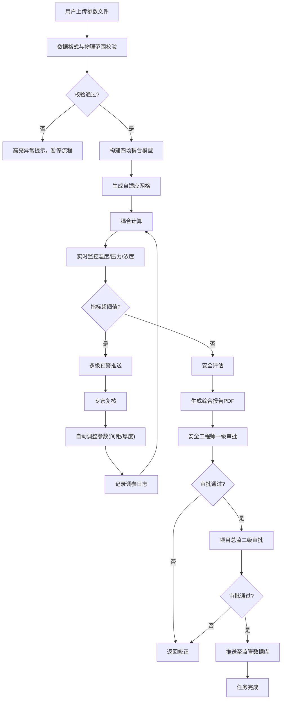
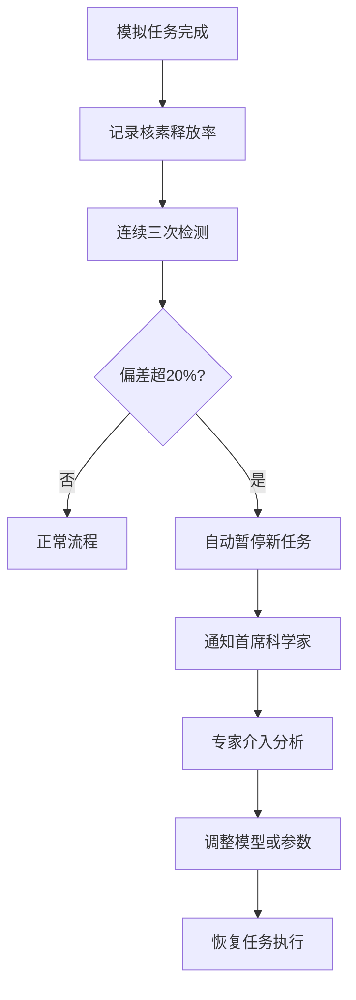
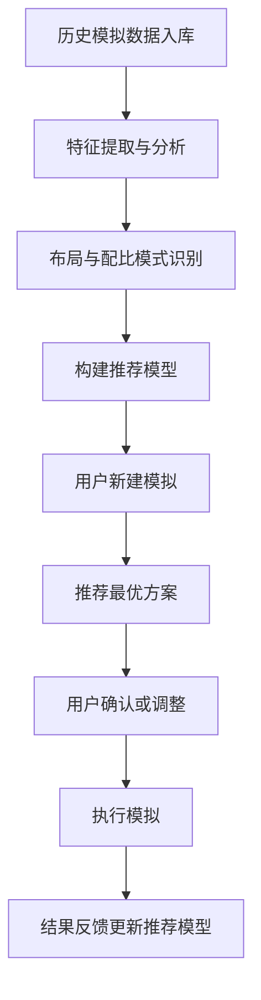

## 1. 产品概述

高放射性废物深地质处置库长期安全模拟与多场耦合评估平台，是面向核工业领域的专业级数值模拟系统，通过热-水-力-化学四场耦合计算，为高放废物地质处置的长期安全性提供科学评估依据。

- 主要用途：处置库设计方案验证、多场耦合效应分析、长期安全性能评估、核素迁移预测
- 目标用户：核安全分析师、地质工程师、项目总监、监管机构人员、首席科学家
- 核心价值：实现处置库全生命周期安全模拟的自动化、智能化、规范化，提升评估效率与决策科学性

## 2. 核心功能

### 2.1 用户角色与权限

| 角色 | 注册方式 | 核心权限 |
|------|----------|----------|
| 安全分析师 | 系统管理员创建 | 上传数据、执行模拟、查看监控、处理预警、导出数据 |
| 地质专家 | 系统管理员创建 | 复核预警、参数调整建议、查看模拟结果 |
| 安全工程师 | 系统管理员创建 | 验证计算收敛性、一级审批、查看详细日志 |
| 项目总监 | 系统管理员创建 | 二级审批、风险评估确认、查看综合看板 |
| 首席科学家 | 系统管理员创建 | 处理异常偏差、查看所有数据、系统配置建议 |
| 系统管理员 | 系统内置 | 用户管理、权限配置、系统维护 |

### 2.2 功能模块清单

1. **数据上传与校验模块**：文件上传、格式校验、物理范围检查、异常高亮提示
2. **模型构建模块**：四场耦合模型自动构建、自适应网格生成
3. **模拟任务管理模块**：任务状态流转、任务队列、异常回退机制
4. **实时监控预警模块**：温度场/孔隙压力/核素浓度实时监控、多级预警推送
5. **参数调优模块**：自动调整废物包间距、缓冲层厚度、调参日志记录
6. **报告生成模块**：综合PDF报告、温度云图、应力应变曲线、核素浓度等值面
7. **数据导出模块**：按处置单元/时间窗口导出全场数据
8. **智能推荐引擎**：历史数据分析、最优布局推荐、回填配比建议
9. **审批流程模块**：两级审批机制、审批意见记录、监管数据库推送
10. **异常处理模块**：连续偏差检测、任务自动暂停、专家通知
11. **综合看板模块**：每日统计、完成率、平均耗时、安全指数趋势
12. **用户权限管理模块**：角色管理、权限控制、操作审计

### 2.3 页面详情

| 页面名称 | 模块名称 | 功能描述 |
|---------|----------|----------|
| 登录页 | 身份认证 | 用户登录、角色识别、密码找回 |
| 首页仪表盘 | 综合看板 | 统计概览、任务状态分布、安全指数趋势、预警提醒 |
| 数据上传页 | 数据上传与校验 | 文件拖拽上传、格式预览、校验结果展示、异常高亮 |
| 任务列表页 | 任务管理 | 任务列表、状态标签、进度条、操作按钮、筛选搜索 |
| 模拟详情页 | 模拟监控 | 状态流转图、实时监控图表、参数配置、计算日志 |
| 预警中心页 | 预警管理 | 预警列表、级别标识、处理状态、复核记录 |
| 报告中心页 | 报告生成 | 报告列表、预览、下载、报告生成进度 |
| 数据导出页 | 数据导出 | 处置单元选择、时间窗口配置、导出格式选择 |
| 智能推荐页 | 推荐引擎 | 历史案例展示、推荐方案对比、参数敏感度分析 |
| 审批中心页 | 审批流程 | 待审批列表、审批表单、审批历史、意见记录 |
| 系统设置页 | 用户管理 | 用户列表、角色配置、权限分配、操作日志 |

## 3. 核心流程

### 3.1 模拟任务主流程

用户上传地质模型、废物包参数和工程屏障参数文件后，系统自动校验数据格式与物理范围。校验通过后自动构建热-水-力-化学四场耦合模型并生成自适应网格。模拟任务经历"待校验→参数解析→网格生成→耦合计算→安全评估→完成"的状态流转，异常时自动回退。计算过程中实时监控关键指标，超阈值时触发多级预警，复核后自动调整参数重新模拟。模拟完成后生成综合报告，经两级审批后推送至监管数据库。

### 3.2 异常检测流程

### 3.3 智能推荐流程

## 4. 用户界面设计

### 4.1 设计风格

- **主色调**：深蓝科技风格，主色 `#0A2463`，辅助色 `#3E92CC`，警示色 `#D8315B`，成功色 `#3FA34D`，中性色 `#F8F9FA`
- **设计理念**：专业、严谨、科技感，符合核工业领域的严肃性与专业性
- **按钮风格**：扁平化设计，轻微圆角(4px)，悬停时有微妙的光影变化
- **字体**：标题使用 `Noto Sans SC Bold`，正文使用 `Noto Sans SC Regular`，等宽数据使用 `JetBrains Mono`
- **布局风格**：顶部导航 + 左侧侧边栏 + 主内容区的经典企业级布局，卡片式信息展示
- **图标风格**：线性风格图标，统一使用 `Lucide Icons`，保持简洁专业
- **数据可视化**：使用 `ECharts`，图表配色与主色调协调，支持暗黑模式切换

### 4.2 页面设计概览

| 页面名称 | 模块名称 | UI元素与设计要点 |
|---------|----------|------------------|
| 首页仪表盘 | 综合看板 | 顶部统计卡片(完成率、平均耗时、安全指数)，中部任务状态分布环形图，底部趋势折线图，右侧预警提醒列表，滚动动画展示数据加载 |
| 数据上传页 | 数据上传 | 大尺寸拖拽上传区域，文件列表展示卡片，校验结果进度条，异常项红色高亮边框，悬停显示详细错误信息 |
| 模拟详情页 | 模拟监控 | 顶部状态流转时间轴，左侧参数配置面板，中部实时监控图表(温度云图、压力曲线、浓度等值面)，右侧计算日志滚动区 |
| 预警中心页 | 预警管理 | 三级预警颜色标识(红/黄/蓝)，预警卡片含位置、数值、阈值、时间，处理状态标签，复核意见展开面板 |
| 审批中心页 | 审批流程 | 待办/已办标签切换，审批卡片含任务信息、当前节点、审批按钮，审批历史时间线展示 |

### 4.3 响应式设计

- **桌面端优先**：1920px最佳显示，适配1280px及以上分辨率
- **平板适配**：侧边栏可折叠，内容区自适应调整
- **触控优化**：按钮最小尺寸44px，关键操作提供触控反馈
- **不支持移动端**：专业数值模拟系统，主要在桌面端使用

### 4.4 可视化设计要点

- **温度云图**：使用热力图渲染，颜色从蓝色(低温)渐变至红色(高温)，支持时间轴动画播放
- **应力应变曲线**：多系列折线图，支持区域选择缩放，数据点悬停显示精确值
- **核素浓度等值面**：3D等值面可视化，支持旋转、缩放操作，透明度可调节
- **安全指数仪表盘**：半圆仪表盘，指针动态动画，分区颜色标识安全等级
- **状态流转动画**：节点高亮动画，进度条平滑过渡，状态变更时的微交互反馈
