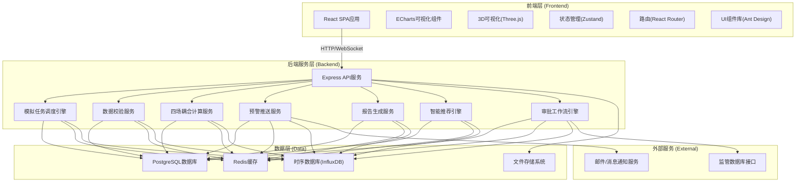
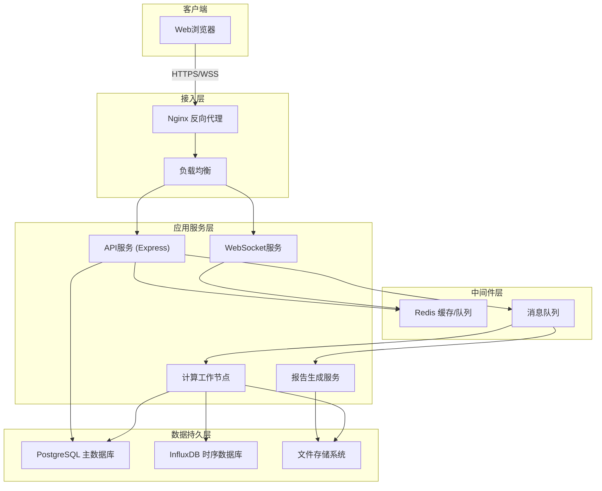
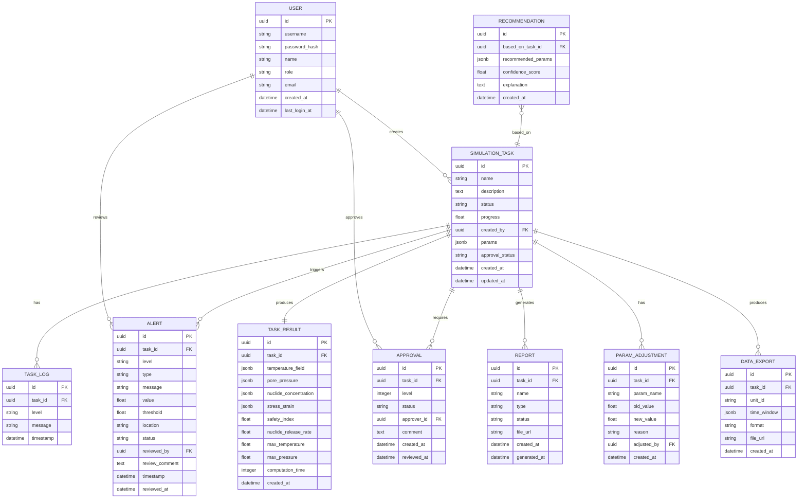

## 1. 架构设计



## 2. 技术描述

### 2.1 前端技术栈
- **框架**: React 18 + TypeScript
- **构建工具**: Vite 5
- **样式**: Tailwind CSS 3 + SCSS
- **UI组件**: Ant Design 5
- **状态管理**: Zustand
- **路由**: React Router v6
- **数据可视化**: ECharts 5
- **3D可视化**: Three.js + @react-three/fiber
- **图标**: Lucide React
- **HTTP客户端**: Axios
- **实时通信**: Socket.io-client
- **表单验证**: React Hook Form + Zod

### 2.2 后端技术栈
- **框架**: Express 4 + TypeScript
- **进程管理**: PM2
- **任务调度**: Bull + Redis
- **认证**: JWT + bcrypt
- **文件处理**: Multer
- **PDF生成**: Puppeteer
- **数据验证**: Zod
- **日志**: Winston

### 2.3 数据库
- **关系型数据库**: PostgreSQL 15
- **缓存**: Redis 7
- **时序数据**: InfluxDB 2.x (用于存储监控时序数据)

### 2.4 开发规范
- **代码规范**: ESLint + Prettier
- **Git钩子**: Husky + lint-staged
- **单元测试**: Jest
- **E2E测试**: Cypress

## 3. 路由定义

| 路由路径 | 页面名称 | 权限要求 |
|----------|---------|----------|
| `/login` | 登录页 | 公开 |
| `/dashboard` | 首页仪表盘 | 所有登录用户 |
| `/upload` | 数据上传页 | 安全分析师、地质专家 |
| `/tasks` | 任务列表页 | 所有登录用户 |
| `/tasks/:id` | 模拟详情页 | 所有登录用户 |
| `/alerts` | 预警中心页 | 安全分析师、地质专家、安全工程师 |
| `/reports` | 报告中心页 | 所有登录用户 |
| `/export` | 数据导出页 | 安全分析师、安全工程师 |
| `/recommendations` | 智能推荐页 | 安全分析师、项目总监 |
| `/approvals` | 审批中心页 | 安全工程师、项目总监 |
| `/settings` | 系统设置页 | 系统管理员 |
| `/settings/users` | 用户管理页 | 系统管理员 |
| `/settings/roles` | 角色权限页 | 系统管理员 |

## 4. API 定义

### 4.1 TypeScript 类型定义

```typescript
// 用户相关类型
interface User {
  id: string;
  username: string;
  name: string;
  role: 'analyst' | 'geologist' | 'engineer' | 'director' | 'scientist' | 'admin';
  email: string;
  createdAt: string;
  lastLoginAt: string;
}

// 模拟任务类型
type TaskStatus = 'pending_validation' | 'parsing' | 'meshing' | 'computing' | 'evaluating' | 'completed' | 'failed' | 'rollback';

interface SimulationTask {
  id: string;
  name: string;
  description: string;
  status: TaskStatus;
  progress: number;
  createdBy: string;
  createdAt: string;
  updatedAt: string;
  params: TaskParams;
  result?: TaskResult;
  approvalStatus: 'pending' | 'approved_level1' | 'approved_level2' | 'rejected';
  logs: TaskLog[];
}

interface TaskParams {
  geologicalModel: FileInfo;
  wastePackageParams: WastePackageParams;
  engineeringBarrierParams: EngineeringBarrierParams;
}

interface WastePackageParams {
  type: string;
  material: string;
  radioactivity: number;
  heatOutput: number;
  spacing: number;
  count: number;
}

interface EngineeringBarrierParams {
  bufferLayer: {
    material: string;
    thickness: number;
    permeability: number;
  };
  backfill: {
    material: string;
    ratio: string;
    compactness: number;
  };
}

interface TaskResult {
  temperatureField: TimeSeriesData;
  porePressure: TimeSeriesData;
  nuclideConcentration: TimeSeriesData;
  stressStrain: StressStrainData;
  safetyIndex: number;
  nuclideReleaseRate: number;
  maxTemperature: number;
  maxPressure: number;
  computationTime: number;
}

// 预警类型
type AlertLevel = 'critical' | 'warning' | 'info';

interface Alert {
  id: string;
  taskId: string;
  level: AlertLevel;
  type: 'temperature' | 'pressure' | 'seepage' | 'concentration';
  message: string;
  value: number;
  threshold: number;
  location: string;
  timestamp: string;
  status: 'pending' | 'reviewed' | 'resolved';
  reviewedBy?: string;
  reviewComment?: string;
  reviewedAt?: string;
}

// 审批类型
interface Approval {
  id: string;
  taskId: string;
  level: 1 | 2;
  status: 'pending' | 'approved' | 'rejected';
  approverId: string;
  approverName: string;
  comment: string;
  createdAt: string;
  reviewedAt?: string;
}

// 报告类型
interface Report {
  id: string;
  taskId: string;
  name: string;
  type: 'comprehensive' | 'temperature' | 'stress' | 'nuclide';
  status: 'generating' | 'ready' | 'failed';
  fileUrl: string;
  createdAt: string;
  generatedAt?: string;
}
```

### 4.2 REST API 接口

| 方法 | 路径 | 描述 | 请求体 | 响应 |
|------|------|------|--------|------|
| POST | `/api/auth/login` | 用户登录 | `{username, password}` | `{token, user}` |
| GET | `/api/auth/me` | 获取当前用户 | - | `User` |
| POST | `/api/upload` | 上传参数文件 | FormData | `{fileId, fileName, validationResult}` |
| GET | `/api/validate/:fileId` | 校验数据文件 | - | `{valid, errors, warnings}` |
| POST | `/api/tasks` | 创建模拟任务 | `TaskParams` | `SimulationTask` |
| GET | `/api/tasks` | 获取任务列表 | `{page, size, status}` | `{items: SimulationTask[], total}` |
| GET | `/api/tasks/:id` | 获取任务详情 | - | `SimulationTask` |
| PUT | `/api/tasks/:id/cancel` | 取消任务 | - | `SimulationTask` |
| GET | `/api/tasks/:id/monitor` | 获取监控数据 | - | `{temperature, pressure, concentration}` |
| GET | `/api/alerts` | 获取预警列表 | `{level, status}` | `Alert[]` |
| PUT | `/api/alerts/:id/review` | 复核预警 | `{comment, adjustmentParams}` | `Alert` |
| POST | `/api/reports` | 生成报告 | `{taskId, type}` | `Report` |
| GET | `/api/reports/:id/download` | 下载报告 | - | PDF文件流 |
| POST | `/api/export` | 导出数据 | `{taskId, unitId, timeWindow, format}` | `{downloadUrl}` |
| GET | `/api/recommendations` | 获取智能推荐 | `{taskType}` | `{recommendations, historyCases}` |
| GET | `/api/approvals` | 获取审批列表 | `{level, status}` | `Approval[]` |
| PUT | `/api/approvals/:id` | 处理审批 | `{status, comment}` | `Approval` |
| GET | `/api/dashboard/stats` | 获取看板统计 | - | `{completionRate, avgTime, safetyIndexTrend}` |
| GET | `/api/users` | 获取用户列表 | - | `User[]` |
| POST | `/api/users` | 创建用户 | `UserInput` | `User` |
| PUT | `/api/users/:id` | 更新用户 | `Partial<UserInput>` | `User` |

### 4.3 WebSocket 事件

| 事件名 | 方向 | 描述 | 数据 |
|--------|------|------|------|
| `task:status` | 服务端→客户端 | 任务状态变更 | `{taskId, status, progress}` |
| `task:log` | 服务端→客户端 | 任务日志更新 | `{taskId, log}` |
| `monitor:data` | 服务端→客户端 | 实时监控数据 | `{taskId, temperature, pressure, concentration}` |
| `alert:new` | 服务端→客户端 | 新预警通知 | `Alert` |
| `report:ready` | 服务端→客户端 | 报告生成完成 | `Report` |

## 5. 服务器架构图



## 6. 数据模型

### 6.1 ER 图



### 6.2 DDL 语句

```sql
-- 用户表
CREATE TABLE users (
    id UUID PRIMARY KEY DEFAULT gen_random_uuid(),
    username VARCHAR(50) UNIQUE NOT NULL,
    password_hash VARCHAR(255) NOT NULL,
    name VARCHAR(100) NOT NULL,
    role VARCHAR(20) NOT NULL CHECK (role IN ('analyst', 'geologist', 'engineer', 'director', 'scientist', 'admin')),
    email VARCHAR(100) UNIQUE NOT NULL,
    created_at TIMESTAMPTZ DEFAULT CURRENT_TIMESTAMP,
    last_login_at TIMESTAMPTZ,
    INDEX idx_role (role)
);

-- 模拟任务表
CREATE TABLE simulation_tasks (
    id UUID PRIMARY KEY DEFAULT gen_random_uuid(),
    name VARCHAR(200) NOT NULL,
    description TEXT,
    status VARCHAR(30) NOT NULL CHECK (status IN ('pending_validation', 'parsing', 'meshing', 'computing', 'evaluating', 'completed', 'failed', 'rollback')),
    progress FLOAT DEFAULT 0,
    created_by UUID NOT NULL REFERENCES users(id),
    params JSONB NOT NULL,
    approval_status VARCHAR(30) DEFAULT 'pending' CHECK (approval_status IN ('pending', 'approved_level1', 'approved_level2', 'rejected', 'pushed')),
    deviation_count INTEGER DEFAULT 0,
    created_at TIMESTAMPTZ DEFAULT CURRENT_TIMESTAMP,
    updated_at TIMESTAMPTZ DEFAULT CURRENT_TIMESTAMP,
    INDEX idx_status (status),
    INDEX idx_created_by (created_by),
    INDEX idx_approval_status (approval_status)
);

-- 任务日志表
CREATE TABLE task_logs (
    id UUID PRIMARY KEY DEFAULT gen_random_uuid(),
    task_id UUID NOT NULL REFERENCES simulation_tasks(id) ON DELETE CASCADE,
    level VARCHAR(10) NOT NULL CHECK (level IN ('info', 'warning', 'error', 'debug')),
    message TEXT NOT NULL,
    timestamp TIMESTAMPTZ DEFAULT CURRENT_TIMESTAMP,
    INDEX idx_task_id (task_id),
    INDEX idx_timestamp (timestamp)
);

-- 任务结果表
CREATE TABLE task_results (
    id UUID PRIMARY KEY DEFAULT gen_random_uuid(),
    task_id UUID NOT NULL UNIQUE REFERENCES simulation_tasks(id) ON DELETE CASCADE,
    temperature_field JSONB,
    pore_pressure JSONB,
    nuclide_concentration JSONB,
    stress_strain JSONB,
    safety_index FLOAT,
    nuclide_release_rate FLOAT,
    max_temperature FLOAT,
    max_pressure FLOAT,
    computation_time INTEGER,
    created_at TIMESTAMPTZ DEFAULT CURRENT_TIMESTAMP
);

-- 预警表
CREATE TABLE alerts (
    id UUID PRIMARY KEY DEFAULT gen_random_uuid(),
    task_id UUID NOT NULL REFERENCES simulation_tasks(id) ON DELETE CASCADE,
    level VARCHAR(10) NOT NULL CHECK (level IN ('critical', 'warning', 'info')),
    type VARCHAR(20) NOT NULL CHECK (type IN ('temperature', 'pressure', 'seepage', 'concentration')),
    message TEXT NOT NULL,
    value FLOAT NOT NULL,
    threshold FLOAT NOT NULL,
    location VARCHAR(100),
    status VARCHAR(20) DEFAULT 'pending' CHECK (status IN ('pending', 'reviewed', 'resolved')),
    reviewed_by UUID REFERENCES users(id),
    review_comment TEXT,
    timestamp TIMESTAMPTZ DEFAULT CURRENT_TIMESTAMP,
    reviewed_at TIMESTAMPTZ,
    INDEX idx_task_id (task_id),
    INDEX idx_level (level),
    INDEX idx_status (status)
);

-- 审批表
CREATE TABLE approvals (
    id UUID PRIMARY KEY DEFAULT gen_random_uuid(),
    task_id UUID NOT NULL REFERENCES simulation_tasks(id) ON DELETE CASCADE,
    level INTEGER NOT NULL CHECK (level IN (1, 2)),
    status VARCHAR(20) DEFAULT 'pending' CHECK (status IN ('pending', 'approved', 'rejected')),
    approver_id UUID REFERENCES users(id),
    comment TEXT,
    created_at TIMESTAMPTZ DEFAULT CURRENT_TIMESTAMP,
    reviewed_at TIMESTAMPTZ,
    UNIQUE (task_id, level),
    INDEX idx_task_id (task_id),
    INDEX idx_status (status)
);

-- 报告表
CREATE TABLE reports (
    id UUID PRIMARY KEY DEFAULT gen_random_uuid(),
    task_id UUID NOT NULL REFERENCES simulation_tasks(id) ON DELETE CASCADE,
    name VARCHAR(200) NOT NULL,
    type VARCHAR(30) NOT NULL CHECK (type IN ('comprehensive', 'temperature', 'stress', 'nuclide')),
    status VARCHAR(20) DEFAULT 'generating' CHECK (status IN ('generating', 'ready', 'failed')),
    file_url VARCHAR(500),
    created_at TIMESTAMPTZ DEFAULT CURRENT_TIMESTAMP,
    generated_at TIMESTAMPTZ,
    INDEX idx_task_id (task_id)
);

-- 参数调整记录表
CREATE TABLE param_adjustments (
    id UUID PRIMARY KEY DEFAULT gen_random_uuid(),
    task_id UUID NOT NULL REFERENCES simulation_tasks(id) ON DELETE CASCADE,
    param_name VARCHAR(50) NOT NULL,
    old_value FLOAT NOT NULL,
    new_value FLOAT NOT NULL,
    reason TEXT NOT NULL,
    adjusted_by UUID NOT NULL REFERENCES users(id),
    created_at TIMESTAMPTZ DEFAULT CURRENT_TIMESTAMP,
    INDEX idx_task_id (task_id)
);

-- 推荐表
CREATE TABLE recommendations (
    id UUID PRIMARY KEY DEFAULT gen_random_uuid(),
    based_on_task_id UUID REFERENCES simulation_tasks(id),
    recommended_params JSONB NOT NULL,
    confidence_score FLOAT NOT NULL,
    explanation TEXT,
    created_at TIMESTAMPTZ DEFAULT CURRENT_TIMESTAMP
);

-- 数据导出表
CREATE TABLE data_exports (
    id UUID PRIMARY KEY DEFAULT gen_random_uuid(),
    task_id UUID NOT NULL REFERENCES simulation_tasks(id) ON DELETE CASCADE,
    unit_id VARCHAR(50) NOT NULL,
    time_window JSONB NOT NULL,
    format VARCHAR(10) NOT NULL CHECK (format IN ('csv', 'json', 'excel')),
    file_url VARCHAR(500),
    created_at TIMESTAMPTZ DEFAULT CURRENT_TIMESTAMP
);

-- 系统配置表
CREATE TABLE system_config (
    key VARCHAR(50) PRIMARY KEY,
    value JSONB NOT NULL,
    updated_at TIMESTAMPTZ DEFAULT CURRENT_TIMESTAMP
);

-- 初始化系统管理员账号
INSERT INTO users (username, password_hash, name, role, email)
VALUES ('admin', '$2b$10$N9qo8uLOickgx2ZMRZoMyeIjZAgcfl7p92ldGxad68LJZdL17lhWy', '系统管理员', 'admin', 'admin@disposal.com');

-- 初始化系统配置
INSERT INTO system_config (key, value) VALUES
('temperature_threshold', '100'),
('pressure_threshold', '10'),
('deviation_threshold', '0.2'),
('waste_package_types', '["UO2", "MOX", "玻璃固化体"]'),
('buffer_materials', '["膨润土", "水泥基材料", "沥青"]'),
('backfill_materials', '["膨润土/砂混合物", "水泥", "碎石"]');
```
